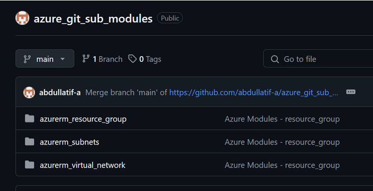
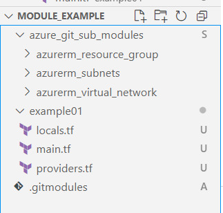

# 📚 Lab: Publish and Use Terraform Modules as Git Submodules

## ✅ Purpose of the Lab

This lab teaches you how to modularize your Terraform code and reuse it across multiple projects by storing it in a Git repository and adding it as a Git submodule.

---

## 🎯 Why This Is Useful in the Real World

| Benefit      | Description |
|--------------|-------------|
| 🔁 Reuse      | You can now reuse modules instead of rewriting them |
| 💡 Clarity    | Your projects are easier to read and manage |
| 📦 Portability| Your modules can be shared across teams or projects |
| 🔐 Control    | You can version your modules and update them when ready |
| 🧠 Experience | You learned a professional workflow used in real companies |

---

## 🔧 Step-by-Step Instructions

### 1️⃣ Download the Previous Lab

Clone the previous lab repo that contains the `Azure` folder.

```bash
git clone https://github.com/Integrify-Finland/devops-terraform-lab-vnet-module.git
```

After cloning, you’ll find two folders inside. The one named `Azure` contains the Terraform modules you’ll use.

---

### 2️⃣ Publish Terraform Modules to GitHub

#### Create a GitHub Repo

Go to GitHub and create a new repository.  
Call it: `azure_git_sub_modules`  
Do **not** initialize it with a README or .gitignore (to avoid conflicts).  
Copy the repo URL.

#### Push the Azure Modules to GitHub

In terminal:

```bash
cd path/to/Azure

# Configure Git if you haven't
git config --global user.name "Your Name"
git config --global user.email "you@example.com"

# Initialize Git
git init

# Stage and commit
git add .
git commit -m "Azure Modules - resource_group"

# Link the remote repo (replace with your URL)
git remote add origin URL

# Push to GitHub
git push --set-upstream origin main
```

**❗ If you see this error:**

```
error: failed to push some refs to '...'
hint: Updates were rejected because the remote contains work that you do not have locally.
```

Run this:

```bash
git pull origin main --allow-unrelated-histories
git push --set-upstream origin main
```
It should look like this in your repository:


---

### 3️⃣ Create a New Project and Add Submodule
```bash
mkdir module_example
cd module_example  
git init

# replace <YOUR_REPO_URL> with your repository URL
git submodule add <YOUR_REPO_URL>

mkdir example01
cd example01
```

---

### 4️⃣ Create Terraform Files in `example01`

#### `providers.tf`

```hcl
terraform {
  required_providers {
    azurerm = {
      source  = "hashicorp/azurerm"
      version = "4.26.0"
    }
  }
}

provider "azurerm" {
  features {}

  subscription_id = "50cff209-0e41-4560-a131-5c873ec03be0"
}
```

#### `locals.tf`

```hcl
locals {
  resource_group_name = "devops2-rg"
  vnet_name           = "devops2-vnet"
  location            = "West Europe"

  tags = {
    bootcamp = "DevOps2"
  }

  address_space = ["10.0.0.0/16"]

  subnet = {
    public_subnet = {
      address_space = ["10.0.2.0/24"]
    }
    private_subnet = {
      address_space = ["10.0.3.0/24"]
    }
  }
}
```

#### `main.tf`

```hcl
module "resource_group" {
  source = "../azure_git_sub_modules/azurerm_resource_group/"

  name     = local.resource_group_name
  location = local.location
  tags     = local.tags
}

module "vnet" {
  source = "../azure_git_sub_modules/azurerm_virtual_network"

  name                = local.vnet_name
  resource_group_name = module.resource_group.resource_group.name
  location            = local.location
  address_space       = local.address_space
  tags                = local.tags
}

module "subnets" {
  source = "../azure_git_sub_modules/azurerm_subnets"

  for_each            = local.subnet
  name                = each.key
  resource_group_name = module.resource_group.resource_group.name
  vnet_name           = module.vnet.virtual_network.name
  address_prefixes    = each.value.address_space
}
```
VS Code folders/files structure should look like this 
---

### 🚀 Provision Infrastructure

Run the following Terraform commands:

```bash
terraform fmt
terraform init
terraform plan
terraform apply
```

---

## ✅ Summary

- You **modularized Terraform code** using Git submodules
- You **published modules to a GitHub repo**
- You **referenced those modules** in a new project using `source = "../path"`
- This setup mimics **real-world DevOps workflows**

